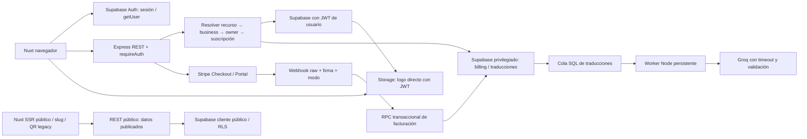

> Actualización comercial del 08/10/2026: el precio oficial para nuevas suscripciones es **17,49 €/mes, IVA incluido (21 %)**. Las tarifas y evidencias de este informe describen el momento de su auditoría; consulta [ACTUALIZACION_PRECIO_CARTELIAX.md](ACTUALIZACION_PRECIO_CARTELIAX.md) para la configuración y pruebas vigentes.

# Auditoría integral preproducción de Carteliax

Fecha: 8 de octubre de 2026. Herramientas ejecutadas: Node22.23.2, PostgreSQL14, Chrome local y Playwright temporal. Alcance: repositorio local, frontend Nuxt, API Express, migraciones disponibles, PostgreSQL desechable y cuenta Stripe **Test** accesible mediante la configuración local. Sin despliegue, cobros Live, cambios de precios existentes ni operaciones sobre Supabase real.

## Resumen ejecutivo

**NO APTO PARA LANZAMIENTO.** Hay correcciones reales implementadas y una batería reproducible, pero aún faltan garantías esenciales para vender:

1. **El Price configurado en Stripe Test cuesta 18,00 EUR/mes, no 15,99 EUR.** Se consultó directamente y se cobraron facturas ficticias de 18 EUR con Test Clocks. El backend ahora bloquea Checkout si el Price no coincide exactamente con 15,99 EUR, mensual, activo y del modo correcto. No se modificó el precio de Stripe. Con la configuración actual Checkout devuelve 503 deliberadamente.
2. Stripe Test devuelve **cero webhookEndpoints registrados**. No se verificó ninguna entrega real Stripe → Carteliax → Supabase. Stripe CLI puede reenviar eventos sin aparecer en esta lista, pero no hay evidencia de ese reenvío en esta auditoría. La configuración Live no se inspeccionó.
3. El repositorio no contiene el esquema/RLS original completo de las tablas principales ni los buckets originales. Se probaron los controles explícitos del backend y las migraciones disponibles, **no el aislamiento del Supabase de producción**.
4. La sincronización segura de facturación requiere una **migración nueva**, creada y probada únicamente en PostgreSQL local. No desplegar el controlador nuevo sin ella.
5. Persisten avisos de dependencias frontend y comprobaciones de despliegue/worker pendientes. No se certifican como explotaciones remotas demostradas.

**Pregunta principal del cobro:** Stripe Test sí intentó y completó automáticamente el primer pago al finalizar siete días, con tarjeta de prueba y `charge_automatically`. También pagó dos renovaciones. **El importe fue 18 EUR. El primer cobro de 15,99 EUR NO está verificado.** Estas suscripciones se crearon con la API de Stripe, no completando Checkout en el navegador.

Las correcciones no modifican la política comercial existente: la gestión se limita a `active` vigente o `trialing` vigente; el contenido ya publicado sigue público cuando se pierde el acceso de gestión. Se solicitó una decisión sobre esa política; al cerrar el informe no se recibió respuesta.

## Entornos y valor de la evidencia

| Tipo | Ejecutado | Qué demuestra | Qué no demuestra |
|---|---|---|---|
| Unitarias/controller con dobles | 66 PASS | Validaciones, autorización, estados, errores, firma con SDK real, llamadas y fechas | Stripe/Supabase reales |
| HTTP real a Express | 128 PASS | Router, middleware y ownership con dos identidades/A1/A2/B1; cuerpos y rutas manipulados | JWT criptográfico de Supabase ni RLS: transportes simulados y RLS omitida intencionadamente |
| PostgreSQL 14 local | PASS | Migraciones reales, permisos SQL, traducciones, micrositios, transacciones y concurrencia de facturación | Esquema original o políticas desplegadas en Supabase |
| Chrome real + Nuxt | 226 escenarios funcionales + 43 grupos públicos + 3 sesiones + 3 preview/contactos PASS | Interacciones, datos de fixtures, descargas, SSR, idiomas, responsive, teclado y logout entre pestañas | Registro real, Storage real, Groq real, pago en Checkout real |
| Stripe Test read-only | EJECUTADO, FAIL comercial | Price real 1800 EUR mensual; lista real vacía de endpoints Test | Live y paneles Vercel/Supabase |
| Stripe Test Clocks/API | EJECUTADO, FAIL comercial | Trials de 604800 s; primer pago; dos renovaciones; cancelación; impago; independencia de tres Customers | Cobro 1599, Checkout E2E, JWT/ownership real, entrega de webhooks a la aplicación |
| Supabase QA/Live y Stripe Live | NO EJECUTADO | Ninguna certificación | Todo el flujo integrado y configuración de destino |

Los usuarios A/B y establecimientos A1/A2/B1 de las pruebas HTTP son fixtures independientes. A posee A1/A2; B posee B1. En PostgreSQL se añaden los equivalentes a un esquema aproximado. Los tres Customers de Test Clocks son nuevos y separados: las etiquetas A1/A2/B1 sirven para las pruebas de Stripe y no representan establecimientos persistidos en Carteliax. En el run ejecutado sus metadatos owner son UUID ficticios independientes; la pertenencia de A1/A2 a un mismo propietario se verifica en HTTP local, no con Auth real.

Evidencias: [carpeta de verificación](docs/preproduction/verification/), [matriz HTTP completa](docs/preproduction/verification/security-matrix.json), [Test Clocks](docs/preproduction/verification/stripe-clocks.json), [instrucciones de repetición](docs/preproduction/verification/README.md).

## Arquitectura y dependencias

Archivos relevantes inspeccionados: `backend/src/app.js`, `server.js`, `config/env.js`, `infrastructure/database/*`, los dos middlewares, todos los módulos de businesses/menus/categories/products/productRelations/productImages/menuThemes/subscriptions/translations/publicMenus/publicSites; composables/middleware/plugins/layout privado, páginas públicas/QR/billing y componentes; migraciones y pruebas existentes.

No existe una capa separada de casos de uso general: predominan controllers con Supabase directo; traducciones sí separa repository/service/provider/worker. No se reescribió esta arquitectura.

### Matriz de permisos

| Recurso/operación | Público | JWT | Propietario | Suscripción vigente | Servicio interno |
|---|---:|---:|---:|---:|---:|
| Health, micrositio y carta publicada | Sí | No | No | No, política actual | No |
| Establecimientos: listar/consultar propios y crear | No | Sí | Sí para existentes; owner deriva del JWT al crear | No | No |
| Editar establecimiento/logo/portada | No | Sí | Sí | Sí | No |
| Cartas/categorías/productos/relaciones/diseño | No | Sí | Sí | Sí, incluido acceso a sus rutas protegidas | No |
| Traducciones privadas y generación | No | Sí | Sí | Sí; además cuotas/cola SQL | Worker para ejecución |
| Consultar billing, crear Checkout/Portal/cancelar intento | No | Sí | Sí | No; es necesario poder recuperar el pago | No |
| Escribir estado de suscripción | No | No como autorización suficiente | No desde cliente | No desde cliente | Webhook firmado + RPC service-only |
| Worker/claim/commit de traducciones | No | No | Actor verificado en frontera SQL | Se valida en cola | Service role |
| Storage directo | Lectura de imágenes públicas | JWT para escritura | Depende de RLS desplegada | No certificado | Backend para operaciones mediadas |

`requireAuth` llama a Supabase `auth.getUser(token)`. No basta decodificar un JWT. `requireActiveSubscription` resuelve el tenant desde el recurso de la ruta, no desde el body; comprueba owner mediante consulta privilegiada antes de billing. `createUserClient` usa el JWT del usuario; los repositorios privilegiados de billing/traducciones tienen una autorización distinta y explícita.

Los endpoints inexistentes no se presentan como funcionalidades: no hay DELETE de establecimiento ni endpoint público para establecer manualmente un estado de pago. Tampoco hay reordenación genérica transaccional verificada.

## Seguridad multi-tenant

La matriz adjunta registra cada petición, identidad, body cuando procede, resultado esperado, real y PASS/FAIL. Se hicieron 35 operaciones por dirección: A → B1; B → A1; B → A2. Se comprobaron lectura/edición/borrado, publicación, imágenes, alérgenos, temas, idiomas y facturación. Tras cada conjunto se comparó todo el estado del fixture: ninguna escritura ajena, ninguna llamada Stripe por ataques ajenos y sin textos privados en errores. Los objetos de A2 tienen sus propias categorías/productos.

| Ataque | Identidad | Esperado | Real | Resultado / evidencia |
|---|---|---|---|---|
| Recursos privados B1 | A | 403/404 sin contenido | 35 rechazos previstos | PASS HTTP con dobles |
| Recursos privados A1 | B | 403/404 sin contenido | 35 rechazos previstos | PASS HTTP con dobles |
| Recursos privados A2 | B | 403/404 sin contenido | 35 rechazos previstos | PASS HTTP con dobles |
| Producto B1 asociado a categoría A1 | A | Rechazo | 404 | PASS |
| Producto A2 asociado a categoría A1, mismo owner | A | Rechazo por business distinto | 400 | PASS |
| business_id en body para sustituir el de ruta | A | Rechazo | 400 | PASS |
| Precio/trial arbitrarios en Checkout | A | Rechazo | 400 | PASS |
| Escribir status billing vía REST de Carteliax | A | Ruta inexistente | 404 | PASS |
| Token ausente/falso/caducado/inexistente | Varias identidades simuladas | 401 | 401 | PASS del middleware con transporte Auth simulado |
| RLS/Storage directo con JWT real A/B | Cuentas QA no disponibles | Rechazo ajeno | No ejecutado | BLOQUEADO: falta Supabase aislado certificado |

### RLS y funciones

Se ejecutaron las migraciones de traducciones y micrositios, sus suites SQL y la nueva migración de billing en un cluster con socket local sin escucha TCP. Se verifican ownership, `WITH CHECK`, restricciones de actor, cola, leases, fencing, reuse dentro de business, publicación, permisos y Storage de portada definidos en esas migraciones. Dos procesos psql demostraron un único ganador en la reserva de Checkout y una aplicación única de un evento repetido simultáneamente.

**No están versionadas todas las RLS originales** de businesses, menus, categories, products, category_products, product_allergens, menu_themes, subscriptions ni todos los grants/funciones/buckets legacy. La función original `duplicate_menu` también debe revisarse en el destino; el fixture SQL contiene una aproximación para probar el wrapper, no evidencia de que el original sea seguro.

La nueva migración habilita RLS de billing, revoca escrituras de anon/authenticated (incluidas columnas), añade una frontera restrictiva de lectura por owner, protege el ledger y limita la RPC a service_role. Una política restrictiva necesita una política permisiva de lectura si se quiere leer directamente con usuario; la API de billing usa el cliente admin con owner explícito. No se cambiaron las demás políticas históricas a ciegas.

[Inventario SQL read-only para revisión manual](docs/preproduction/verification/supabase-readonly-preflight.sql). No se ejecutó sobre Supabase real.

## Stripe y estados de acceso

| Escenario | Resultado | Evidencia | Tipo de prueba | Riesgo pendiente |
|---|---|---|---|---|
| Price 15,99 EUR mensual | **FAIL: 18 EUR** | stripe-readonly.json + facturas Test | Stripe Test real | Configurar Price correcto Test/Live; guard bloquea altas actuales |
| Checkout propiedad/body/precio/concurrencia | PASS | preproduction.test.js, api.log, SQL concurrente | Controller/HTTP con dobles + PostgreSQL real | Completar Checkout real con Price correcto |
| Checkout E2E con tarjeta | BLOQUEADO | Price incorrecto; no se cambió comercialmente | No ejecutado | Tarjeta, retorno y asociación real no certificados |
| Trial siete días | PASS: 604800 s | Tres suscripciones trialing | Stripe Test Clocks real/API | No fue el Checkout de Carteliax |
| Método de pago y cobro automático | PASS en fixtures Stripe | pm_card_visa, charge_automatically, invoices paid | Stripe Test real | Checkout pide payment_method_collection=always por código; UI real pendiente |
| Primer cobro **15,99 EUR** | **FAIL: invoices paid 1800** | stripe-clocks.json | Stripe Test real | Repetir con 1599, nunca afirmar verificado el importe requerido |
| Primera y segunda renovación | PASS mecánica; FAIL importe requerido | Tres facturas pagadas en cada renovación | Stripe Test real | Sin actualización real de Carteliax vía webhook |
| Impago de renovación | PASS: A2 past_due; B1 active | Tarjeta oficial de fallo en fixture nuevo | Stripe Test real | Otras causas de rechazo/SCA/caducidad no probadas de extremo a extremo |
| Cancelación al final del periodo | PASS: A1 canceled; A2 no cancelado | Actualización/avance del reloj | Stripe Test real | Portal real y cancelación durante trial/inmediata pendientes |
| Suscripciones independientes | PASS Customers separados + HTTP A1/A2 independientes | Clocks, matrix, SQL | Stripe real separado + fixtures app | No certifica ownership Auth real |
| Portal ajeno y customer compartido | PASS: 403/409 antes de Stripe | Regresiones y matriz | Dobles | Configuración/acciones reales del Portal no verificadas |
| Firma ausente/falsa | PASS: 400 | SDK Stripe real + cuerpos de prueba | Unitario/controller | Transporte HTTP firmado real pendiente |
| Modo Live enviado a backend Test / Connect | Rechazado por código; Live firmado PASS unitario | preproduction.test.js | SDK firma + dobles | Cuenta/event destination Live no inspeccionada |
| Sesión y subscription con customer/business diferentes | PASS: 500 sin escritura, reintentable | webhooks-audit.test.js | Dobles | Revisión de asociaciones históricas |
| Ledger duplicado / entrega concurrente | PASS | billing-database.sql y dos conexiones psql | PostgreSQL real | Aplicar migración y repetir en Supabase QA |
| Evento antiguo de otra subscription | PASS tras fix; fallo anterior reproducido | webhook-before.log + SQL | Controller anterior con dobles + SQL real | Históricos sin attempt requieren reconciliación |
| Evento fuera de orden | PASS timestamp anterior; canceled no resucita | SQL | PostgreSQL real | Empates en un mismo segundo y carreras entre lectura Stripe/escritura no completamente eliminados |
| Fallo Supabase al aplicar webhook | PASS: 500; ledger transaccional revierte | Unitario + SQL rollback | Dobles + PostgreSQL | Reintento entregado por Stripe no probado contra app real |
| Webhook Test registrado | **FAIL: lista vacía** | stripe-readonly.json | Stripe real read-only | Configurar endpoint/reenvío y verificar entrega |
| Webhook Live, Portal Live, Price Live | NO EJECUTADO | Sin inspección del panel Live | Pendiente | Bloqueante de lanzamiento |

Eventos consumidos tras la corrección: `checkout.session.completed`, `customer.subscription.created`, `.updated`, `.deleted`, `invoice.paid`, `invoice.payment_failed`. `customer.subscription.trial_will_end` no se consume: es un aviso previo y no determina la autorización; su notificación puede configurarse en Stripe. Eventos no consumidos se reconocen sin sincronizar.

La ruta conserva `express.raw` antes de `express.json`; se verifica firma antes de cualquier sincronización. Se consulta el estado actual de Stripe y se valida modo, negocio, owner, Customer, Price único y quantity=1; active/trial requieren periodo. La RPC reclama el evento y actualiza la fila bajo lock en una sola transacción. Un evento de una subscription histórica no sustituye a la actual. No se concede acceso desde `?checkout=success` ni desde un body del frontend.

### Política existente, conservada

| Estado local | Gestión backend | Web/QR publicado |
|---|---|---|
| trialing con trial futuro | Permitida | Visible |
| trialing expirado/sin fecha | 402 | Visible |
| active con periodo futuro | Permitida | Visible |
| active con periodo expirado | 402 | Visible |
| active con periodo NULL legacy | Permitida, compatibilidad preexistente | Visible |
| past_due/unpaid/canceled/incomplete/incomplete_expired/paused/inactive/checkout_pending/sin fila | 402 | Visible si ya publicado |
| Fallo DB al consultar permisos | 500; no concede acceso | La consulta pública puede fallar |

`cancel_at_period_end=true` no revoca un periodo vigente con status active. El frontend usa ahora las mismas fechas que el backend. No se añadió una gracia de impago ni suspensión pública. La excepción active/NULL legacy requiere inventario/reconciliación manual, no eliminación silenciosa.

## Funcionalidades y resiliencia

| Funcionalidad | Estado | Evidencia | Bug/corrección o límite |
|---|---|---|---|
| Registro/login/logout | PASS UI simulada; Auth real NO EJECUTADO | regression-extended y sesiones Chrome | Logout entre pestañas desmonta páginas privadas; 401 redirige login |
| Crear/editar establecimiento, slugs/reservados | PASS fixtures HTTP/UI + SQL micrositios | matrix/new-business/extended/database | Slug se normaliza; no se consideró fallo la normalización prevista |
| Eliminar establecimiento | NO EXISTE endpoint | Router inspeccionado; DELETE 404 | No se inventó ni añadió |
| Varias cartas, CRUD, publicación/despublicación | PASS fixtures UI/HTTP | flows/extended/additional | Persistencia real QA pendiente |
| Categorías CRUD/ocultar/asociar/reordenar | PASS fixtures UI; ownership HTTP | extended/relations/matrix | No certifica atomicidad de reordenación multipetición |
| Productos precio/descripcion/alérgenos/agotado/categoría | PASS fixtures UI/HTTP/unitarios | 226 escenarios + schemas + matrix | Rechazo negativos/no finitos/más de 2 decimales/mass assignment |
| Imágenes producto | PASS bytes sharp + errores de transporte + UI | images-audit, image-before, extended | Fix evita borrar imagen ya comprometida si se perdió respuesta |
| Portada | PASS migración/SQL y UI simulada | microsites SQL + preview/details | Límites bytes/MIME se inspeccionaron; Storage real pendiente |
| Logo | PASS flujo UI y ownership HTTP | extended/matrix | Subida directa; validación frontend y existencia/path backend; bytes/bucket/RLS real pendientes |
| MIME falsificado producto | PASS: 400 antes de Storage | images-audit.test.js | SVG/script no aceptado como PNG; límites 5 MB/25 MP por código |
| Storage ajeno / límites reales / limpieza global huérfanos | BLOQUEADO/NO EJECUTADO | No Supabase QA verificado | No se certifican buckets originales ni limpieza exhaustiva |
| Traducciones es/val/en/fr/manual/fallback | PASS unitario, SQL y UI con dobles | translations suites + regression-languages | No llamadas reales Groq; errores/malformed/quota/leases cubiertos localmente |
| Consumo IA abusivo | PASS cuotas/fencing SQL local | translations-production-guards | Cuotas/grants/worker desplegados pendientes |
| Micrositio cuatro plantillas | PASS Chrome/SSR, ocho anchuras | public-browser, 43 grupos | Datos ficticios; no certificar fotos reales/restaurantes de producción |
| Horarios/contactos/Maps/redes/dirección larga | PASS fixture Chrome | details-browser | Enlaces correctos; destino externo real no probado; mapa bajo demanda |
| QR PNG/PDF/permanente/legacy | PASS descargas bytes y URLs fixtures | extended/states/public-browser | Escaneo físico con cámara no ejecutado |
| Dos guardados/red duplicada/pago ambiguo | PASS escenarios específicos | CAS/concurrencia/fixtures | No prueba de carga distribuida sobre servicios reales |
| Errores Supabase/Stripe/Groq | PASS casos controlados | unitarios/API/SQL | No chaos testing real; no concesión de acceso por fallos probados |
| Dashboard y publicación del diseño | PASS Chrome simulado | private-browser y extended | Preservados los cambios públicos anteriores |

No se ocultaron productos agotados para esta auditoría: **la consulta pública existente filtra `is_available=true`**. El componente puede representar agotados si los recibe, pero la API actual los excluye; se conservó esa regla. La carta/publicación no se modificó para simular disponibilidad.

No se ejecutó carga agresiva, pruebas destructivas ni envío de datos privados a Groq. Concurrencia HTTP prueba el código con dobles; concurrencia SQL usa locks reales. No cubre todos los fallos posibles de todos los proveedores.

## Bugs encontrados y correcciones

Cada entrada diferencia fallo reproducido, configuración observada y riesgo aún no reproducido en destino.

### B01 — P0: precio configurado distinto del vendido

- Archivo/configuración: `stripeService.js`, STRIPE_PRICE_ID del entorno local.
- Causa: Checkout aceptaba el Price configurado sin consultar importe/divisa/intervalo.
- Reproducción: consulta read-only y Test Clocks; unit_amount=1800, primera factura/renovaciones=1800.
- Riesgo: cobro por encima de los 15,99 EUR solicitados. No hubo cobros Live.
- Corrección: guard de Price activo, modo correcto, EUR, 1599, month/1; no cambia recursos Stripe.
- Regresión: `wrong commercial price never creates Checkout`, HTTP manipulación de precio/trial.
- Estado: **guard corregido; configuración y cobro 1599 pendientes**, bloqueo de altas actual.

### B02 — P0: dos Checkout simultáneos por establecimiento

- Archivo: `subscriptionController.js`.
- Causa: lectura + upsert de reservas diferentes; claves de idempotencia distintas por intento. La idempotencia Stripe no protege dos claves diferentes.
- Reproducción: baseline unitario con Promise.all produjo más de una llamada create; `regressions-before.log`.
- Riesgo: dos sesiones pagables y suscripciones cobradas para el mismo establecimiento.
- Corrección: INSERT único inicial o UPDATE compare-and-set; perdedor 409; restricciones únicas en migración.
- Regresión: unitario one-session + PostgreSQL dos conexiones one-winner.
- Estado: **corregido en código/local SQL; requiere migración**.

### B03 — P1: timeout Stripe liberaba una reserva posiblemente pagable

- Archivo: `subscriptionController.js`.
- Causa: no distinguir fallo antes de enviar de respuesta perdida después de crear remotamente.
- Reproducción: SDK simulado arroja StripeConnectionError; baseline retiraba reserva.
- Riesgo: siguiente intento crea otro Checkout.
- Corrección: mantener reserva tras iniciar SDK; timeout acotado/reintento con la misma clave; reserva sin sessionId necesita soporte para reconciliar, también si es legacy sin attempt y su fecha local ha vencido.
- Regresión: `Stripe network ambiguity retains reservation`.
- Estado: **corregido; recuperación automática completa pendiente**. Se prioriza no duplicar cobros; una reserva ambigua puede bloquear al cliente hasta revisión.

### B04 — P1: Checkout completado sin webhook podía contratarse otra vez

- Archivo: `subscriptionController.js`.
- Causa: caducidad local suficiente para reutilizar reserva, sin comprobar session.status.
- Reproducción: sesión local vencida y Stripe complete; baseline llamaba create de nuevo.
- Corrección: consultar la sesión anterior; solo expired permite nueva; complete/open o sessionId desconocido no liberan el intento.
- Regresión: `completed old session without webhook cannot be paid twice`.
- Estado: **corregido**; reconciliación necesaria si falta webhook.

### B05 — P1: un webhook de suscripción antigua sobrescribía la vigente

- Archivo: `stripeWebhookController.js` y migración de billing.
- Causa: upsert por business_id sin exigir subscription actual/reserva/owner/customer.
- Reproducción: evento firmado deleted de sub_old tras una sub_0 vigente; controller original devuelve 200 y guarda canceled/sub_old. `webhook-before.log`.
- Riesgo: un restaurante legítimo pierde acceso; asociación de factura/suscripción incorrecta.
- Corrección: vinculación estricta y fence de intento en RPC bloqueada; antigua devuelve unrelated sin tocar vigente.
- Regresión: SQL old/current binding, owner incorrecto rollback y sesión de Customer/business incoherentes.
- Estado: **corregido en código/SQL local; aplicar migración**.

### B06 — P1: ledger y sincronización no eran una transacción

- Archivo: `stripeWebhookController.js`.
- Causa: leer ledger, actualizar billing e insertar evento por separado.
- Reproducción: inspección de operaciones originales; pruebas concurrentes sobre la solución SQL. No se afirma haber provocado corrupción de Supabase real.
- Riesgo: carreras/reintentos con aplicación parcial o reconocimiento incorrecto.
- Corrección: INSERT evento único + ownership + row lock + UPDATE en RPC única; fallo revierte ledger; errores HTTP500.
- Regresión: duplicado, stale, owner-error rollback, dos psql mismo evento (synced/duplicate).
- Estado: **corregido; integración real pendiente**.

### B07 — P1: no hay endpoints webhook registrados en Stripe Test

- Archivo: configuración de Stripe; código no podía resolverlo solo.
- Reproducción: `webhookEndpoints.list` real devuelve lista vacía.
- Riesgo: Checkout remoto no activa estado local; cancelaciones/impagos no llegan si no existe otro transporte.
- Corrección: no se configuró un destino sin conocer URL/entorno seguro ni se modificó Stripe Live.
- Test: `stripe-readonly-audit.cjs`.
- Estado: **pendiente manual**. Live no inspeccionado; no extrapolar lista Test a Live.

### B08 — P1: webhook de otro modo no se rechazaba explícitamente

- Archivo: `stripeWebhookController.js`, `env.js`.
- Reproducción: evento con firma válida de prueba y livemode=true; baseline no validaba el modo.
- Riesgo: contaminación Test/Live ante una configuración de secretos o reenvío incorrecta.
- Corrección: modo de evento y subscription coherentes con clave; eventos Connect rechazados; STRIPE_MODE explícito/matching.
- Regresión: Live firmado sobre backend Test devuelve400 antes de acceso DB.
- Estado: **corregido**. Verificación de cuenta Live y firmas del destino real pendiente.

### B09 — P2: respuesta perdida al guardar foto eliminaba un archivo en uso

- Archivo: `productImageController.js`.
- Reproducción: commit de image_url y respuesta503 simulada; controller anterior borraba el objeto y llamaba next(error). `image-before.log`.
- Riesgo: referencia rota/pérdida de la imagen nueva.
- Corrección: leer estado antes de limpiar; confirmación de commit responde éxito; lectura incierta conserva archivo; limpieza solo si se prueba no utilizado.
- Regresión: dos casos commit confirmado/readback incierto + MIME falso con sharp real.
- Estado: **corregido**, posible huérfano preferido a borrar datos si no se puede confirmar.

### B10 — P2: errores completos de SDK llegaban a logs

- Archivos: app, billing, product/productImage/business controllers, middleware.
- Causa: serialización console.error(error) con message/raw/request arbitrarios.
- Riesgo: detalles privados o de proveedor en logs. No se encontró un secreto real en el build ni se afirma una filtración histórica.
- Corrección: logSafeError emite códigos/tipos permitidos; respuestas genéricas; contextos constantes.
- Regresión: error con sentinel privado/raw/request no se serializa.
- Estado: **endurecido**; logs Vercel y retención histórica no inspeccionados.

### B11 — P2: UUID inválido llegaba al servicio privilegiado

- Archivo: `requireActiveSubscription.js` y app.
- Causa: solo comprobación de presencia; error PostgreSQL terminaba500.
- Reproducción: /products/not-a-uuid; JSON roto.
- Corrección: UUID antes de DB; JSON inválido/tamañoJSON devuelve400.
- Regresión: matriz HTTP malformed IDs/body.
- Estado: **corregido**; rechazo no filtra datos.

### B12 — P2: sesión terminada podía dejar una página privada montada

- Archivos: `session.client.ts`, `supabase.ts`, `useApi.ts`.
- Causa: no había listener global que desmontase rutas auth al recibir SIGNED_OUT de otra pestaña; errores401 durante edición solo se mostraban.
- Corrección: plugin cliente dependiente explícito de Supabase; logout redirige solo rutas auth; 401 privado lleva a login. Las URLs públicas siguen abiertas.
- Regresión: Chrome dos pestañas privadas + una pública; ruta directa sin sesión; respuesta401.
- Estado: **corregido y validado con transporte Auth simulado**; logout real/refresco/red offline con Supabase QA pendientes. Se corrigió durante QA el orden inicial de plugins; no queda ese fallo en la entrega.

### B13 — P2: billing frontend indicaba acceso para periodos vencidos

- Archivo: `useSubscription.ts` / `subscriptionAccess.ts`.
- Causa: status active/trialing suficiente en UI; backend exige fechas.
- Reproducción: trialing con trial_ends_at anterior; lógica anterior true, backend402.
- Corrección: helper de fechas espejo, conservando active/NULL legacy.
- Regresión: 10 estados, fechas futuras/vencidas/ausentes/inválidas.
- Estado: **corregido**. No altera permisos backend ni política comercial.

### B14 — P1 condicionado: un Customer compartido permite Portal de varias suscripciones

- Archivo: `subscriptionController.js` y nueva migración.
- Causa: Portal por Customer, sin validar que ese Customer pertenezca solo al business solicitado.
- Reproducción: fixture con A1/A2 mismo customer; nueva regresión verifica 409 y cero llamadas Stripe. No se encontraron Customers compartidos reales porque no se inventarió Supabase real.
- Riesgo: Portal global de ese Customer podría gestionar otra suscripción; reutilización indebida en Checkout.
- Corrección: detectar y bloquear shared Customer en Checkout/Portal; índice Customer único. No dividir ni reatribuir datos históricos automáticamente.
- Estado: **protección implementada**; inventario histórico y migración pendientes. La independencia real observada usa Customers nuevos separados.

## Riesgos pendientes y seguridad general

| ID | Prioridad | Hallazgo/límite | Acción requerida |
|---|---|---|---|
| V01 | P1, bloqueo de evidencia | RLS/grants/RPC/buckets originales no versionados ni probados en destino | Exportar esquema sin datos/secrets, revisar y atacar Supabase QA con dos usuarios reales |
| V02 | P1, configuración | Stripe Live/Price/destino webhook/Portal no inspeccionados | Checklist y prueba integrada Test antes de Live |
| V03 | P1 si solo serverless | Worker usa bucle persistente en server.js; repo no acredita infraestructura Vercel para ejecutarlo | Garantizar worker/cola durable en infraestructura actual o solución mínima de ejecución autorizada; comprobar jobs reales |
| V04 | P2; evaluar superficie | npm audit frontend: 15 paquetes afectados, ahora 8 high/7 critical; backend0 | Revisar avisos/dependencias compatibles; no equivale a 15 ataques remotos demostrados |
| V05 | P2 | No rate limiter general Express; Groq sí tiene cuotas SQL | Definir límites por identidad/IP y frontera de despliegue, probar sin carga agresiva |
| V06 | P2 | Logo sube directo; backend verifica path/existencia, no reencodea bytes | Confirmar allowed_mime_types/tamaño/RLS; probar MIME falso, SVG/HTML y objetos ajenos en QA |
| V07 | P2 | Escrituras directas Supabase pueden evitar gates Express si RLS histórica no comprueba billing | Verificar operaciones REST/Storage con JWT QA para cada tabla, no certificar por UI |
| V08 | P2 | Reordenaciones son operaciones independientes, sin garantía transaccional global | Reproducir fallos parciales QA y decidir RPC mínima; no se reescribió sin evidencia suficiente |
| V09 | P1 en pago afectado | Sin reconciliación periódica fiable demostrada; webhook perdido, empate de timestamps y reserva ambigua | Alarmas, replay, procedimiento de reconciliación y pruebas reales de eventos simultáneos/mismo segundo |
| V10 | Decisión comercial | Publicado visible sin pago; active/NULL legacy permitido | Confirmar política y reconciliar filas; no suspender restaurantes silenciosamente |
| V11 | P2, integración | PUBLIC API sin cache/límites certificados; health no comprueba dependencias | Medir coste/caché/monitorización en staging; no se hizo stress real |
| V12 | P3, diagnóstico | El servidor Nuxt local emitió avisos de rutas /api sin correspondencia durante fixtures; los avisos h3 statusMessage se corrigieron | Revisar API_URL/routing en staging; no se afirma consola de servidor completamente limpia |

La actualización compatible de Nuxt pasó de 4.5.2 a **4.6.0** en lockfile, manteniendo framework/rango declarado. Build, tipos y navegador pasan. **No resolvió los 15 avisos**: antes 9high/6critical y después 8high/7critical, por cambios de cadenas transitorias. Se registran ambos JSON. Hay avisos en `@simple-git/argv-parser`, `simple-git`, `node-forge`, `braces`, `source-map-js` y sus dependientes. Muchos pertenecen a herramientas de desarrollo/build; es necesario determinar la superficie desplegada. Se consultaron versiones disponibles; no se forzó un downgrade Nuxt3 ni overrides mayores de herramientas Git sin verificar compatibilidad. El recuento npm no es un análisis de explotabilidad runtime.

Otras observaciones de código:

- Helmet y CORS de un origen concreto; CORS no sustituye autorización. Bearer headers, sin depender de cookies como autorización REST, reducen CSRF convencional; políticas reales del deployment pendientes.
- SQL via Supabase/PostgREST/RPC parametrizada, schemas estrictos en entradas; no se identificó concatenación de SQL ejecutada a partir de entradas HTTP.
- No se identificó v-html para textos de restaurante; Vue los escapa. JSON-LD escapa `<`. No hubo campaña dinámica XSS exhaustiva sobre todos los campos del destino.
- SSRF: Groq usa URL constante; procesamiento de imágenes por bytes o paths propios; no se encontró un fetch backend de URL arbitraria del cliente en los flujos revisados. No se certifica infraestructura/red real.
- Redirects de Checkout/Portal se construyen en backend con FRONTEND_URL; cliente no envía URL de retorno/precio/trial. HTTPS exigido en producción. Las rutas públicas permanentes y legacy se verifican localmente.
- Ningún valor local de SUPABASE_SECRET_KEY, STRIPE_SECRET_KEY, STRIPE_WEBHOOK_SECRET o GROQ_API_KEY aparece en los 775 archivos del build inspeccionado. Esto no certifica Vercel ni todo el historial Git. `.env` está en ignores de backend/frontend.

## Pruebas ejecutadas y comandos

| Comando/suite | Resultado final | Evidencia |
|---|---|---|
| `npm test --prefix backend` | PASS 66/66 | unit.log |
| Regresiones nuevas contra controllers originales | FAIL esperado, 5 subtests + padre; 14 PASS | regressions-before.log |
| Misma batería inicial corregida | PASS 20/20 | regressions-after.log |
| `node backend/test/reproduce-image-before.cjs` | REPRODUCIDO bug original | image-before.log; snapshot temporal |
| `node backend/test/reproduce-webhook-before.cjs` | REPRODUCIDO bug original | webhook-before.log; snapshot temporal |
| `node backend/test/api-audit.cjs` | PASS 128 | api.log/security-matrix.json |
| `node backend/test/database-audit.cjs` | PASS, tres migraciones + cinco suites SQL existentes + billing + concurrencia | database.log |
| `npm run build --prefix frontend` | PASS Nuxt4.6 producción | build.log |
| `vue-tsc --noEmit -p` root/app/server/shared/node | PASS cinco configuraciones | typecheck.log; vacío significa sin diagnósticos |
| `node backend/test/secrets-build-audit.cjs` | PASS 775 archivos | secrets-build.json |
| `npm audit --prefix backend --omit=dev --json` | PASS 0 avisos | dependencies-backend.json |
| `npm audit --prefix frontend --omit=dev --json` antes/después | FAIL: 15 paquetes afectados | dependencies-frontend*.json |
| `npm update nuxt --prefix frontend --ignore-scripts --no-audit --no-fund` | Ejecutado, rango compatible; avisos pendientes | dependency-update.log/lockfile |
| `node backend/test/stripe-readonly-audit.cjs` | FAIL comercial, ejecución real exit1 | stripe-readonly.json |
| `node backend/test/stripe-clock-audit.cjs` | FAIL importe, pruebas Stripe Test ejecutadas | stripe-clocks.json/log |
| `node docs/preproduction/verification/functional-browser.cjs` | PASS siete suites, 226 escenarios | functional-browser.json + logs por suite |
| `node docs/preproduction/verification/sessions-browser.cjs` | PASS 3 | sessions-browser.json/log |
| `node docs/public-redesign/verification/browser.cjs` | PASS 43 grupos; errors=[]; unexpected=[] | public-browser.log y public-redesign/browser.json |
| `node docs/public-redesign/verification/private.cjs` | PASS 2 | private-browser.log |
| `node docs/public-redesign/verification/details.cjs` | PASS 1 | details-browser.log |
| `node docs/preproduction/verification/ssr-proxy.cjs` | PASS 7 respuestas SSR/proxy reales con backend fixture | ssr-proxy.json/log |
| Auth/Supabase/Storage QA reales | BLOQUEADO | Falta identificar/provisionar entorno aislado seguro |
| Checkout real/Portal real/pago1599/webhook real a app | BLOQUEADO/NO EJECUTADO | Precio y transporte sin configurar/verificar |
| Stripe Live/Vercel/políticas desplegadas | NO EJECUTADO | Sin inspección de destinos reales |

Las suites existentes no se cambiaron para ocultar regresiones. El selector del caso público QR en `regression-extended.cjs` pasó de button a **link**, correspondiente a la navegación ancla del rediseño anterior; permanecen las aserciones de precio, alérgenos y productos. El harness puede usar una clave ficticia de sesión explícita. La suite histórica `microsites-browser.cjs` tiene métricas de hero/botones de idioma anteriores: **no se cuenta como PASS**; la cobertura vigente la proporciona public-redesign/browser. La matriz legacy sí se ejecutó sin rebajar sus aserciones (99 casos). Durante QA falló el orden del nuevo plugin; se corrigió y las pruebas de sesión pasan. Se regeneraron los tipos Nuxt tras la actualización/metadata. El typecheck tras build detectó imports automáticos de servidor no disponibles; se corrigieron con imports explícitos h3/Nitro. Build y las cinco configuraciones pasan después de esa corrección; siete pruebas SSR/HTTP adicionales validan ambos proxies y sus 404.

El frontend se abrió realmente en Chrome con servidor de producción Nuxt local. Responsive verificado a 320,375,390,430,768,1024,1280,1440. Capturas de las cuatro plantillas en [screenshots](docs/public-redesign/screenshots/). No se declara perfección visual ni rendimiento de producción a partir de fixtures. Se verifican SSR/no-JS, canonical, JSON-LD, idiomas/fallback, teclado, reduced-motion, fotografías fallidas, cartas extensas y datos incompletos. Hay 404 de imágenes deliberados para comprobar fallback; no se contabilizan como fallos inesperados. Las pruebas públicas no registraron errores JS/hidratación. El servidor Nuxt sí emitió avisos Vue Router de rutas `/api/categories/.../products` y `/api/businesses/...` durante escenarios de fixtures; no se atribuyen a producción sin reproducir allí. Los avisos h3 sobre statusMessage se corrigieron usando message en ambos proxies y la página pública. La consola de servidor no se certifica como completamente limpia.

## Cambios realizados

### Aplicación

- `backend/.env.example`: STRIPE_MODE=test; no secretos reales modificados.
- `backend/src/config/env.js`: Test/Live explícito y HTTPS producción.
- `backend/src/app.js`: errores sanitizados y JSON inválido400.
- `backend/src/utils/logSafeError.js`: helper nuevo.
- `backend/src/middlewares/requireActiveSubscription.js`: UUID antes de DB/log seguro.
- `backend/src/modules/subscriptions/stripeService.js`: guard Price/SDK timeout.
- `backend/src/modules/subscriptions/subscriptionController.js`: reserva CAS, sesión anterior, ambigüedad, cuerpos estrictos, Customer aislado, cancelación CAS.
- `backend/src/modules/subscriptions/stripeWebhookController.js`: firma/modo/binding/fechas y RPC transaccional.
- `backend/src/modules/productImages/productImageController.js`: readback antes de cleanup/logs.
- `backend/src/modules/products/productController.js`: logs seguros de compensación.
- `backend/src/modules/businesses/businessController.js`: logs seguros Storage.
- `supabase/migrations/202610080001_billing_webhook_safety.sql`: migración nueva, no ejecutada en Supabase.
- `frontend/app/composables/useApi.ts`: 401 login.
- `frontend/app/composables/useSubscription.ts`, `app/utils/subscriptionAccess.ts`: fechas UI coherentes.
- `frontend/app/plugins/session.client.ts`: logout entre pestañas/rutas privadas.
- `frontend/app/plugins/supabase.ts`: nombre explícito para dependencia de plugin.
- `frontend/server/api/public/menus/[businessId]/[slug].get.ts`, `frontend/server/api/public/sites/[slug].get.ts`: imports explícitos tras typecheck, mensajes h3 seguros, timeout legacy15s y logs proxy sin respuesta completa.
- `frontend/app/pages/[publicSlug].vue`: mensaje de error h3 sin statusMessage largo; conserva status404/502.
- `frontend/package-lock.json`: Nuxt compatible4.6 y resolución transitoria.

### Pruebas/documentación

- `backend/test/preproduction.test.js`, `images-audit.test.js`, `webhooks-audit.test.js`, `frontend-access.test.js`, `log-safety.test.js`.
- `backend/test/helpers/audit-fixture.js`, `audit-transport.js`.
- `backend/test/api-audit.cjs`, `database-audit.cjs`, `billing-database.sql`.
- `backend/test/stripe-readonly-audit.cjs`, `stripe-clock-audit.cjs`, `secrets-build-audit.cjs`.
- `backend/test/reproduce-image-before.cjs`, `reproduce-webhook-before.cjs`: reproducción original con snapshots privados temporales; fuera de la batería normal.
- `docs/microsites/verification/browser.cjs`, `regression-extended.cjs`: configuración fixture/selector vigente.
- `docs/preproduction/verification/README.md`, `sessions-browser.cjs`, `functional-browser.cjs`, `ssr-proxy.cjs`, `supabase-readonly-preflight.sql`.
- JSON/logs en `docs/preproduction/verification/` (incluidos logs de cada suite), `docs/public-redesign/verification/browser.json` y capturas regeneradas en `docs/public-redesign/screenshots/`.
- Este informe. No se modificaron migraciones aplicadas anteriormente, claves, RLS real, datos reales, recursos Live ni el modelo de QR.

## Compatibilidad y decisiones técnicas

La migración añade una columna, índices, políticas y función; no borra ni reasigna datos. Los índices fallan si ya hay business/subscription/customer duplicados: **revisar antes**, sin auto-merge. Un webhook de una contratación histórica sin checkout_attempt_id compatible no se enlaza a una fila distinta silenciosamente: necesita reconciliación. PriceID diferente en suscripciones históricas tampoco se acepta automáticamente en el nuevo webhook; revisar los contratos/Price anteriores antes de cambiar configuración o desplegar.

Se mantienen trial de siete días, monthly1599 como condición validada, método de pago always, trial_used_at y las reglas de acceso existentes. Bloquear temporalmente un pago ambiguo es preferible a reemitirlo con posibilidad de doble cobro; el informe especifica recuperación manual. No se implementó una reconciliación periódica nueva sin infraestructura definida.

Fuentes oficiales para interpretar los límites de las pruebas: [Stripe Test Clocks](https://docs.stripe.com/billing/testing/test-clocks), [Stripe trials](https://docs.stripe.com/billing/subscriptions/trials), [Stripe webhooks](https://docs.stripe.com/webhooks). Los resultados de los fixtures son evidencia propia, no se infieren de la documentación.

## Matriz completa de peticiones locales

Todas las filas siguientes son HTTP real a Express con Auth/PostgREST/Stripe simulados, RLS omitida. `qa-a` posee A1/A2; `qa-b` posee B1. Los UUID son ficticios. Los DELETE404 de business prueban que esa operación no existe; no certifican una política DELETE de Supabase.

| # | Identidad | Petición | Body QA | Esperado | Real | Resultado |
|---:|---|---|---|---|---:|---|
| 1 | anonymous | `GET /api/businesses` | `` | 401 | 401 | PASS |
| 2 |  | `GET /api/businesses` | `` | 401 | 401 | PASS |
| 3 | manipulated.jwt | `GET /api/businesses` | `` | 401 | 401 | PASS |
| 4 | expired-fixture | `GET /api/businesses` | `` | 401 | 401 | PASS |
| 5 | nonexistent-user | `GET /api/businesses` | `` | 401 | 401 | PASS |
| 6 | qa-a | `GET /api/businesses/33333333-3333-4333-8333-333333333333` | `` | 404 | 404 | PASS |
| 7 | qa-a | `PATCH /api/businesses/33333333-3333-4333-8333-333333333333` | `{"name":"Hacked","public_profile":{"about":"Hacked"}}` | 403 | 403 | PASS |
| 8 | qa-a | `DELETE /api/businesses/33333333-3333-4333-8333-333333333333` | `` | 404 | 404 | PASS |
| 9 | qa-a | `GET /api/businesses/33333333-3333-4333-8333-333333333333/menus` | `` | 403 | 403 | PASS |
| 10 | qa-a | `POST /api/businesses/33333333-3333-4333-8333-333333333333/menus` | `{"name":"Hacked","slug":"hacked"}` | 403 | 403 | PASS |
| 11 | qa-a | `GET /api/menus/66666666-6666-4666-8666-666666666666` | `` | 403 | 403 | PASS |
| 12 | qa-a | `PATCH /api/menus/66666666-6666-4666-8666-666666666666` | `{"is_published":true}` | 403 | 403 | PASS |
| 13 | qa-a | `DELETE /api/menus/66666666-6666-4666-8666-666666666666` | `` | 403 | 403 | PASS |
| 14 | qa-a | `POST /api/menus/66666666-6666-4666-8666-666666666666/duplicate` | `{}` | 403 | 403 | PASS |
| 15 | qa-a | `POST /api/menus/66666666-6666-4666-8666-666666666666/categories` | `{"name":"Hacked"}` | 403 | 403 | PASS |
| 16 | qa-a | `PATCH /api/categories/88888888-8888-4888-8888-888888888888` | `{"name":"Hacked"}` | 403 | 403 | PASS |
| 17 | qa-a | `DELETE /api/categories/88888888-8888-4888-8888-888888888888` | `` | 403 | 403 | PASS |
| 18 | qa-a | `POST /api/categories/88888888-8888-4888-8888-888888888888/products` | `{"productId":"dddddddd-dddd-4ddd-8ddd-dddddddddddd"}` | 403 | 403 | PASS |
| 19 | qa-a | `DELETE /api/categories/88888888-8888-4888-8888-888888888888/products/dddddddd-dddd-4ddd-8ddd-dddddddddddd` | `` | 403 | 403 | PASS |
| 20 | qa-a | `GET /api/businesses/33333333-3333-4333-8333-333333333333/products` | `` | 403 | 403 | PASS |
| 21 | qa-a | `POST /api/businesses/33333333-3333-4333-8333-333333333333/products` | `{"name":"Hacked","price":1}` | 403 | 403 | PASS |
| 22 | qa-a | `PATCH /api/products/dddddddd-dddd-4ddd-8ddd-dddddddddddd` | `{"price":0}` | 403 | 403 | PASS |
| 23 | qa-a | `DELETE /api/products/dddddddd-dddd-4ddd-8ddd-dddddddddddd` | `` | 403 | 403 | PASS |
| 24 | qa-a | `POST /api/products/dddddddd-dddd-4ddd-8ddd-dddddddddddd/image` | `{}` | 403 | 403 | PASS |
| 25 | qa-a | `DELETE /api/products/dddddddd-dddd-4ddd-8ddd-dddddddddddd/image` | `` | 403 | 403 | PASS |
| 26 | qa-a | `PUT /api/products/dddddddd-dddd-4ddd-8ddd-dddddddddddd/allergens` | `{"allergenIds":[1]}` | 403 | 403 | PASS |
| 27 | qa-a | `PATCH /api/businesses/33333333-3333-4333-8333-333333333333/logo` | `{"path":"33333333-3333-4333-8333-333333333333/11111111-1111-4111-8111-111111111111.png"}` | 403 | 403 | PASS |
| 28 | qa-a | `DELETE /api/businesses/33333333-3333-4333-8333-333333333333/logo` | `` | 403 | 403 | PASS |
| 29 | qa-a | `POST /api/businesses/33333333-3333-4333-8333-333333333333/cover` | `{}` | 403 | 403 | PASS |
| 30 | qa-a | `DELETE /api/businesses/33333333-3333-4333-8333-333333333333/cover` | `` | 403 | 403 | PASS |
| 31 | qa-a | `GET /api/menus/66666666-6666-4666-8666-666666666666/theme` | `` | 403 | 403 | PASS |
| 32 | qa-a | `PUT /api/menus/66666666-6666-4666-8666-666666666666/theme` | `{}` | 403 | 403 | PASS |
| 33 | qa-a | `POST /api/menus/66666666-6666-4666-8666-666666666666/theme/publish` | `{}` | 403 | 403 | PASS |
| 34 | qa-a | `GET /api/menus/66666666-6666-4666-8666-666666666666/languages` | `` | 403 | 403 | PASS |
| 35 | qa-a | `POST /api/menus/66666666-6666-4666-8666-666666666666/languages/en/translate` | `{}` | 403 | 403 | PASS |
| 36 | qa-a | `PUT /api/menus/66666666-6666-4666-8666-666666666666/languages/en/text` | `{}` | 403 | 403 | PASS |
| 37 | qa-a | `GET /api/subscriptions/33333333-3333-4333-8333-333333333333` | `` | 403 | 403 | PASS |
| 38 | qa-a | `POST /api/subscriptions/checkout` | `{"businessId":"33333333-3333-4333-8333-333333333333"}` | 403 | 403 | PASS |
| 39 | qa-a | `POST /api/subscriptions/portal` | `{"businessId":"33333333-3333-4333-8333-333333333333"}` | 403 | 403 | PASS |
| 40 | qa-a | `POST /api/subscriptions/checkout/cancel` | `{"businessId":"33333333-3333-4333-8333-333333333333"}` | 403 | 403 | PASS |
| 41 | qa-b | `GET /api/businesses/11111111-1111-4111-8111-111111111111` | `` | 404 | 404 | PASS |
| 42 | qa-b | `PATCH /api/businesses/11111111-1111-4111-8111-111111111111` | `{"name":"Hacked","public_profile":{"about":"Hacked"}}` | 403 | 403 | PASS |
| 43 | qa-b | `DELETE /api/businesses/11111111-1111-4111-8111-111111111111` | `` | 404 | 404 | PASS |
| 44 | qa-b | `GET /api/businesses/11111111-1111-4111-8111-111111111111/menus` | `` | 403 | 403 | PASS |
| 45 | qa-b | `POST /api/businesses/11111111-1111-4111-8111-111111111111/menus` | `{"name":"Hacked","slug":"hacked"}` | 403 | 403 | PASS |
| 46 | qa-b | `GET /api/menus/44444444-4444-4444-8444-444444444444` | `` | 403 | 403 | PASS |
| 47 | qa-b | `PATCH /api/menus/44444444-4444-4444-8444-444444444444` | `{"is_published":true}` | 403 | 403 | PASS |
| 48 | qa-b | `DELETE /api/menus/44444444-4444-4444-8444-444444444444` | `` | 403 | 403 | PASS |
| 49 | qa-b | `POST /api/menus/44444444-4444-4444-8444-444444444444/duplicate` | `{}` | 403 | 403 | PASS |
| 50 | qa-b | `POST /api/menus/44444444-4444-4444-8444-444444444444/categories` | `{"name":"Hacked"}` | 403 | 403 | PASS |
| 51 | qa-b | `PATCH /api/categories/77777777-7777-4777-8777-777777777777` | `{"name":"Hacked"}` | 403 | 403 | PASS |
| 52 | qa-b | `DELETE /api/categories/77777777-7777-4777-8777-777777777777` | `` | 403 | 403 | PASS |
| 53 | qa-b | `POST /api/categories/77777777-7777-4777-8777-777777777777/products` | `{"productId":"99999999-9999-4999-8999-999999999999"}` | 403 | 403 | PASS |
| 54 | qa-b | `DELETE /api/categories/77777777-7777-4777-8777-777777777777/products/99999999-9999-4999-8999-999999999999` | `` | 403 | 403 | PASS |
| 55 | qa-b | `GET /api/businesses/11111111-1111-4111-8111-111111111111/products` | `` | 403 | 403 | PASS |
| 56 | qa-b | `POST /api/businesses/11111111-1111-4111-8111-111111111111/products` | `{"name":"Hacked","price":1}` | 403 | 403 | PASS |
| 57 | qa-b | `PATCH /api/products/99999999-9999-4999-8999-999999999999` | `{"price":0}` | 403 | 403 | PASS |
| 58 | qa-b | `DELETE /api/products/99999999-9999-4999-8999-999999999999` | `` | 403 | 403 | PASS |
| 59 | qa-b | `POST /api/products/99999999-9999-4999-8999-999999999999/image` | `{}` | 403 | 403 | PASS |
| 60 | qa-b | `DELETE /api/products/99999999-9999-4999-8999-999999999999/image` | `` | 403 | 403 | PASS |
| 61 | qa-b | `PUT /api/products/99999999-9999-4999-8999-999999999999/allergens` | `{"allergenIds":[1]}` | 403 | 403 | PASS |
| 62 | qa-b | `PATCH /api/businesses/11111111-1111-4111-8111-111111111111/logo` | `{"path":"11111111-1111-4111-8111-111111111111/11111111-1111-4111-8111-111111111111.png"}` | 403 | 403 | PASS |
| 63 | qa-b | `DELETE /api/businesses/11111111-1111-4111-8111-111111111111/logo` | `` | 403 | 403 | PASS |
| 64 | qa-b | `POST /api/businesses/11111111-1111-4111-8111-111111111111/cover` | `{}` | 403 | 403 | PASS |
| 65 | qa-b | `DELETE /api/businesses/11111111-1111-4111-8111-111111111111/cover` | `` | 403 | 403 | PASS |
| 66 | qa-b | `GET /api/menus/44444444-4444-4444-8444-444444444444/theme` | `` | 403 | 403 | PASS |
| 67 | qa-b | `PUT /api/menus/44444444-4444-4444-8444-444444444444/theme` | `{}` | 403 | 403 | PASS |
| 68 | qa-b | `POST /api/menus/44444444-4444-4444-8444-444444444444/theme/publish` | `{}` | 403 | 403 | PASS |
| 69 | qa-b | `GET /api/menus/44444444-4444-4444-8444-444444444444/languages` | `` | 403 | 403 | PASS |
| 70 | qa-b | `POST /api/menus/44444444-4444-4444-8444-444444444444/languages/en/translate` | `{}` | 403 | 403 | PASS |
| 71 | qa-b | `PUT /api/menus/44444444-4444-4444-8444-444444444444/languages/en/text` | `{}` | 403 | 403 | PASS |
| 72 | qa-b | `GET /api/subscriptions/11111111-1111-4111-8111-111111111111` | `` | 403 | 403 | PASS |
| 73 | qa-b | `POST /api/subscriptions/checkout` | `{"businessId":"11111111-1111-4111-8111-111111111111"}` | 403 | 403 | PASS |
| 74 | qa-b | `POST /api/subscriptions/portal` | `{"businessId":"11111111-1111-4111-8111-111111111111"}` | 403 | 403 | PASS |
| 75 | qa-b | `POST /api/subscriptions/checkout/cancel` | `{"businessId":"11111111-1111-4111-8111-111111111111"}` | 403 | 403 | PASS |
| 76 | qa-b | `GET /api/businesses/22222222-2222-4222-8222-222222222222` | `` | 404 | 404 | PASS |
| 77 | qa-b | `PATCH /api/businesses/22222222-2222-4222-8222-222222222222` | `{"name":"Hacked","public_profile":{"about":"Hacked"}}` | 403 | 403 | PASS |
| 78 | qa-b | `DELETE /api/businesses/22222222-2222-4222-8222-222222222222` | `` | 404 | 404 | PASS |
| 79 | qa-b | `GET /api/businesses/22222222-2222-4222-8222-222222222222/menus` | `` | 403 | 403 | PASS |
| 80 | qa-b | `POST /api/businesses/22222222-2222-4222-8222-222222222222/menus` | `{"name":"Hacked","slug":"hacked"}` | 403 | 403 | PASS |
| 81 | qa-b | `GET /api/menus/55555555-5555-4555-8555-555555555555` | `` | 403 | 403 | PASS |
| 82 | qa-b | `PATCH /api/menus/55555555-5555-4555-8555-555555555555` | `{"is_published":true}` | 403 | 403 | PASS |
| 83 | qa-b | `DELETE /api/menus/55555555-5555-4555-8555-555555555555` | `` | 403 | 403 | PASS |
| 84 | qa-b | `POST /api/menus/55555555-5555-4555-8555-555555555555/duplicate` | `{}` | 403 | 403 | PASS |
| 85 | qa-b | `POST /api/menus/55555555-5555-4555-8555-555555555555/categories` | `{"name":"Hacked"}` | 403 | 403 | PASS |
| 86 | qa-b | `PATCH /api/categories/cccccccc-cccc-4ccc-8ccc-cccccccccccc` | `{"name":"Hacked"}` | 403 | 403 | PASS |
| 87 | qa-b | `DELETE /api/categories/cccccccc-cccc-4ccc-8ccc-cccccccccccc` | `` | 403 | 403 | PASS |
| 88 | qa-b | `POST /api/categories/cccccccc-cccc-4ccc-8ccc-cccccccccccc/products` | `{"productId":"eeeeeeee-eeee-4eee-8eee-eeeeeeeeeeee"}` | 403 | 403 | PASS |
| 89 | qa-b | `DELETE /api/categories/cccccccc-cccc-4ccc-8ccc-cccccccccccc/products/eeeeeeee-eeee-4eee-8eee-eeeeeeeeeeee` | `` | 403 | 403 | PASS |
| 90 | qa-b | `GET /api/businesses/22222222-2222-4222-8222-222222222222/products` | `` | 403 | 403 | PASS |
| 91 | qa-b | `POST /api/businesses/22222222-2222-4222-8222-222222222222/products` | `{"name":"Hacked","price":1}` | 403 | 403 | PASS |
| 92 | qa-b | `PATCH /api/products/eeeeeeee-eeee-4eee-8eee-eeeeeeeeeeee` | `{"price":0}` | 403 | 403 | PASS |
| 93 | qa-b | `DELETE /api/products/eeeeeeee-eeee-4eee-8eee-eeeeeeeeeeee` | `` | 403 | 403 | PASS |
| 94 | qa-b | `POST /api/products/eeeeeeee-eeee-4eee-8eee-eeeeeeeeeeee/image` | `{}` | 403 | 403 | PASS |
| 95 | qa-b | `DELETE /api/products/eeeeeeee-eeee-4eee-8eee-eeeeeeeeeeee/image` | `` | 403 | 403 | PASS |
| 96 | qa-b | `PUT /api/products/eeeeeeee-eeee-4eee-8eee-eeeeeeeeeeee/allergens` | `{"allergenIds":[1]}` | 403 | 403 | PASS |
| 97 | qa-b | `PATCH /api/businesses/22222222-2222-4222-8222-222222222222/logo` | `{"path":"22222222-2222-4222-8222-222222222222/11111111-1111-4111-8111-111111111111.png"}` | 403 | 403 | PASS |
| 98 | qa-b | `DELETE /api/businesses/22222222-2222-4222-8222-222222222222/logo` | `` | 403 | 403 | PASS |
| 99 | qa-b | `POST /api/businesses/22222222-2222-4222-8222-222222222222/cover` | `{}` | 403 | 403 | PASS |
| 100 | qa-b | `DELETE /api/businesses/22222222-2222-4222-8222-222222222222/cover` | `` | 403 | 403 | PASS |
| 101 | qa-b | `GET /api/menus/55555555-5555-4555-8555-555555555555/theme` | `` | 403 | 403 | PASS |
| 102 | qa-b | `PUT /api/menus/55555555-5555-4555-8555-555555555555/theme` | `{}` | 403 | 403 | PASS |
| 103 | qa-b | `POST /api/menus/55555555-5555-4555-8555-555555555555/theme/publish` | `{}` | 403 | 403 | PASS |
| 104 | qa-b | `GET /api/menus/55555555-5555-4555-8555-555555555555/languages` | `` | 403 | 403 | PASS |
| 105 | qa-b | `POST /api/menus/55555555-5555-4555-8555-555555555555/languages/en/translate` | `{}` | 403 | 403 | PASS |
| 106 | qa-b | `PUT /api/menus/55555555-5555-4555-8555-555555555555/languages/en/text` | `{}` | 403 | 403 | PASS |
| 107 | qa-b | `GET /api/subscriptions/22222222-2222-4222-8222-222222222222` | `` | 403 | 403 | PASS |
| 108 | qa-b | `POST /api/subscriptions/checkout` | `{"businessId":"22222222-2222-4222-8222-222222222222"}` | 403 | 403 | PASS |
| 109 | qa-b | `POST /api/subscriptions/portal` | `{"businessId":"22222222-2222-4222-8222-222222222222"}` | 403 | 403 | PASS |
| 110 | qa-b | `POST /api/subscriptions/checkout/cancel` | `{"businessId":"22222222-2222-4222-8222-222222222222"}` | 403 | 403 | PASS |
| 111 | qa-a | `GET /api/businesses/11111111-1111-4111-8111-111111111111` | `` | 200 | 200 | PASS |
| 112 | qa-a | `GET /api/subscriptions/22222222-2222-4222-8222-222222222222` | `` | 200 | 200 | PASS |
| 113 | qa-a | `POST /api/categories/77777777-7777-4777-8777-777777777777/products` | `{"productId":"dddddddd-dddd-4ddd-8ddd-dddddddddddd"}` | 404 | 404 | PASS |
| 114 | qa-a | `POST /api/categories/77777777-7777-4777-8777-777777777777/products` | `{"productId":"eeeeeeee-eeee-4eee-8eee-eeeeeeeeeeee"}` | 400 | 400 | PASS |
| 115 | qa-a | `PATCH /api/products/99999999-9999-4999-8999-999999999999?businessId=33333333-3333-4333-8333-333333333333` | `{"price":0,"business_id":"33333333-3333-4333-8333-333333333333"}` | 400 | 400 | PASS |
| 116 | qa-a | `PATCH /api/subscriptions/11111111-1111-4111-8111-111111111111` | `{"status":"active"}` | 404 | 404 | PASS |
| 117 | qa-a | `POST /api/subscriptions/checkout` | `{"businessId":"11111111-1111-4111-8111-111111111111","price":"price_free","trialDays":365}` | 400 | 400 | PASS |
| 118 | qa-a | `PATCH /api/products/not-a-uuid` | `{"name":"Name"}` | 400 | 400 | PASS |
| 119 | qa-a | `PATCH /api/categories/not-a-uuid` | `{"name":"Name"}` | 400 | 400 | PASS |
| 120 | qa-a | `PATCH /api/menus/not-a-uuid` | `{"name":"Name"}` | 400 | 400 | PASS |
| 121 | qa-a | `POST /api/businesses` | `"{invalid"` | 400 | 400 | PASS |
| 122 | qa-a | `POST /api/businesses` | `{"name":"Test","slug":"valid-slug","public_slug":"login"}` | 400 | 400 | PASS |
| 123 | qa-a | `POST /api/businesses` | `{"name":"Test","slug":"valid-slug","public_slug":"a"}` | 400 | 400 | PASS |
| 124 | qa-a | `POST /api/businesses` | `{"name":"Test","slug":"valid-slug","public_slug":"Bad / Slug"}` | 201 | 201 | PASS |
| 125 | qa-a | `POST /api/businesses` | `{"name":"Test","slug":"valid-slug","owner_id":"bbbbbbbb-bbbb-4bbb-8bbb-bbbbbbbbbbbb"}` | 400 | 400 | PASS |
| 126 | qa-a | `POST /api/businesses/11111111-1111-4111-8111-111111111111/products` | `{"name":"Dish","price":-1}` | 400 | 400 | PASS |
| 127 | qa-a | `PATCH /api/products/99999999-9999-4999-8999-999999999999` | `{"price":5}` | 402 | 402 | PASS |
| 128 | anonymous | `GET /api/public/menus/11111111-1111-4111-8111-111111111111/principal` | `` | 404 | 404 | PASS |

## PASOS MANUALES PARA JORDI

**No aceptar clientes de pago todavía. No hace falta cambiar Storage ni ejecutar SQL en producción durante esta auditoría; sí hay preparación y pruebas obligatorias antes de desplegar la corrección.**

1. **Preparar un Supabase de QA aislado** con el esquema original completo, Auth y buckets. Confirmar que no contiene restaurantes/clientes reales. Crear usuarios A/B reales y A1/A2/B1 con suscripciones separadas. Exportar esquema/RLS/grants/funciones sin datos ni secretos, ejecutar el inventario read-only y probar por REST/Storage los ataques de la matriz con JWT reales. Comprobar SELECT/INSERT/UPDATE/DELETE y WITH CHECK de cada tabla/relación, funciones SECURITY DEFINER y bucket logos/product-images/business-covers. Verificar también que llamadas directas no falsifican estados de pago ni eluden ownership.
2. **Revisar y aplicar primero en QA la migración nueva `202610080001_billing_webhook_safety.sql`**. Necesita las tablas originals `businesses`, `subscriptions`, `stripe_webhook_events` y campos usados por el código. Revisar duplicados por business, subscription y customer; si existen, resolverlos de forma explícita con sus contratos antes de aplicar, sin borrar datos automáticamente. Revisar permisos/políticas de lectura existentes. NO desplegar el webhook nuevo sin RPC/grants/índices. Tras prueba y revisión, planificar aplicación de esa migración al destino; ninguna se ejecutó allí en esta tarea.
3. **Stripe Test: configurar un Price de 15,99 EUR mensual** (unit_amount1599, currency eur, recurring.interval month/interval_count1, active, livemode=false). Inspeccionarlo en Dashboard/API; el valor de la landing no sirve. No modificar el Price18 ni suscripciones existentes automáticamente. Configurar STRIPE_PRICE_ID de QA con el correcto. Revisar impuestos/descuentos y total final según condiciones comerciales.
4. **Verificar trial por Checkout real**: STRIPE_MODE=test, clave sk_test y webhook secret del destino correcto, FRONTEND_URL QA. Crear un business nuevo sin trial_used_at; abrir Checkout desde Carteliax e introducir tarjeta oficial de prueba. Verificar payment_method_collection=always, subscription.trial_end-trial_start=604800, metadata business/owner/checkout_attempt, Customer independiente y fila correcta en Supabase. No tomar checkout=success como pago confirmado. Al recontratar un establecimiento con trial usado no debe concederse otro.
5. **Configurar webhook Test** a la URL HTTPS real de QA terminada en `/api/subscriptions/webhook` o reenvío Stripe CLI controlado. Eventos: checkout.session.completed; customer.subscription.created/updated/deleted; invoice.paid; invoice.payment_failed. Usar el signing secret específico del destino, no mezclar el de CLI con Dashboard. Registrar entregas200 y fallo500/reintento. Verificar raw body, modo, duplicates y replay de eventos antiguos/deleted. trial_will_end es opcional como aviso; no abre acceso por sí mismo.
6. **Repetir Test Clocks con Price1599** y verificar factura/amount_paid1599 al terminar trial, primera/segunda renovación, impago, cancelación durante trial/al final, y estado/acceso **en Carteliax vía webhooks**. El script entregado prueba la API Stripe, no el Checkout integrado: completar también ese flujo. Probar tarjetas rechazadas/SCA/caducadas y estados unpaid/incomplete/incomplete_expired/paused donde procedan. No esperar siete días reales. No crear cobros Live para QA.
7. **Revisar Customer Portal Test**: gestión/cancelación permitida y return_url QA; entrar por A1 y confirmar que no contiene A2/B1. La integración exige Customer independiente; el código bloquea los compartidos. Probar recuperación de past_due y periodo cancel_at_period_end sin bloquear un periodo ya pagado.
8. **Reservas ambiguas e históricos:** si hay checkout_pending sin sessionId, localizar la sesión por metadata business/attempt en Stripe, confirmar si existe, si está open/complete/expired y su subscription. Si complete, reconciliar/reentregar evento con el enlace correcto; si open, caducarla antes de liberar. No limpiar reservas ni crear otra suscripción sin confirmar. Revisar active sin current_period_end, sesiones antiguas sin attempt y PriceIDs históricos; no cancelar/reasignar suscripciones de clientes a ciegas.
9. **Decidir la política de impago/cancelación pública**: actualmente se bloquea gestión y se mantiene web/QR publicado. Si quieres suspensión pública o gracia, definirla explícitamente y crear pruebas; esta auditoría no la cambia.
10. **Stripe Live, antes de venta:** revisar cuenta correcta, activar/inspeccionar Price Live1599 EUR mensual, Portal Live, destino HTTPS Live y signing secret Live. Configurar STRIPE_MODE=live con sk_live, Price y webhook del mismo entorno; revisar permisos del usuario que administra facturación. No sustituir esas revisiones por las pruebas Test. Verificar que no se usan claves Test por error ni secretos backend en variables NUXT_PUBLIC_*.
11. **Vercel/infraestructura:** confirmar URL API y frontend, CORS exacto, HTTPS, rutas públicas/legacy, backend Express/raw body, secretos privados, límites de ejecución/imágenes y observabilidad. La cola de traducciones necesita un ejecutor fiable: probar que el worker realmente procesa jobs tras acabar una petición y sobrevive a reinicios; no dar por válido un bucle Node en serverless. Revisar dependencias vulnerables y su superficie runtime/build antes de cerrar el riesgo.
12. **Storage y recursos visuales:** no hay cambio automático de buckets ni obligación de actualizar logos/portadas existentes. Revisar límites/tipos y políticas originales en QA, MIME falsificado/archivo grande/objetos ajenos, borrados y huérfanos. No habilitar lecturas públicas de tablas privadas para arreglar previews.
13. **Ejecutar batería completa y monitorizar staging**, incluido registro/login/refresh/logout reales, publicación/QR, imágenes/traducciones/errores y dos tenants simultáneos. Aprobar la migración/deployment solo cuando Price1599, primer cobro1599, webhooks reales y aislamiento RLS estén demostrados. No se ha publicado ningún cambio.
14. **Fixtures Stripe de esta auditoría:** únicamente Test, etiquetados `carteliax-audit-2026-10-08T10-55-42-193Z`. Si quieres limpiarlos, hacerlo manualmente por esa etiqueta; IDs privados locales en `/tmp/carteliax-stripe-audit-resources.json`. No se borraron clientes/suscripciones preexistentes. Los recursos locales PostgreSQL son desechables y los servidores de QA se detienen al finalizar.
