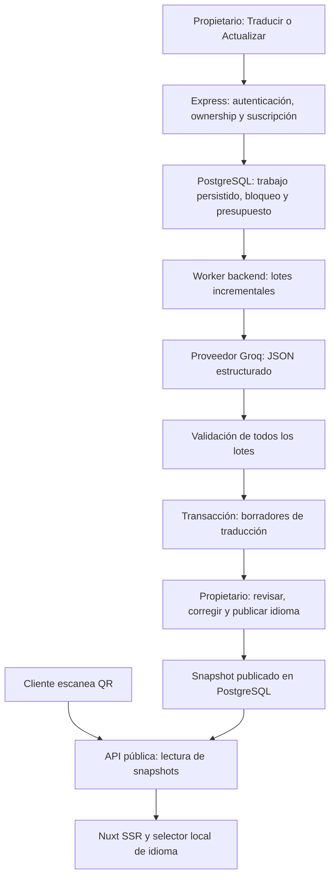

# Multiidioma de Carteliax — entrega y verificación

Implementado en el repositorio el 6 de octubre de 2026. **No activado ni desplegado en Supabase. No se ha llamado a Groq real.** El código, migración y pruebas locales están terminados; la validación externa sigue pendiente. No se modificaron variables de entorno reales ni se realizaron cobros.

## 1. Arquitectura y flujo

Controller, validación, servicio, proveedor, repositorio y worker están separados. El proveedor puede sustituirse sin cambiar la persistencia ni la UI. El worker integrado utiliza la cola PostgreSQL: varios procesos pueden reclamar trabajos con `SKIP LOCKED` sin duplicarlos. Un fallo de proceso vence la concesión de dos minutos y marca el trabajo fallido; no lo reenvía automáticamente a la IA. El cierre del backend drena el lote actual y evita comenzar otro.

## 2. Auditoría y conservación del producto

[Auditoría previa](docs/translations/AUDITORIA.md). Se inspeccionaron frontend, SSR, backend, permisos, contratos y esquema expuesto por REST. Las operaciones privadas actuales permiten al propietario (`businesses.owner_id`), no a `business_members`; se mantiene ese permiso. No se añadió un modelo paralelo de miembros.

No se cambiaron queries privadas, filtros, watchers, selección de establecimientos ni payloads CRUD existentes. El proxy público, rutas QR, Stripe, Checkout, Portal, Storage, precios, imágenes, disponibilidad y relaciones originales se conservan. Se eliminó únicamente un log del middleware frontend que imprimía información de sesión; su lógica de autenticación no cambió.

**Limitación de auditoría:** PostgREST no expone políticas RLS ni cuerpos SQL existentes. No había un dump o migraciones previas accesibles. Por ello no se ha podido verificar SQL de las políticas originales ni el cuerpo real de `duplicate_menu`. El fixture local usa una función de duplicación de prueba. La nueva migración no altera esa función ni las políticas existentes. La consulta de inspección se entrega en `supabase/inspection/translations-preflight.sql`.

Recuentos remotos leídos al inicio: 2 establecimientos, 2 cartas, 2 categorías, 1 producto, 14 alérgenos, 2 suscripciones, 0 miembros y 0 diseños. Lectura final: **2 establecimientos, 3 cartas, 3 categorías, 2 productos, 14 alérgenos, 2 suscripciones, 0 miembros y 2 diseños**. Esta implementación no efectuó escrituras en ese Supabase; el aumento corresponde a cambios externos durante la sesión. No se afirma igualdad de esos recuentos. Con fixtures controlados, la UI conserva todos los registros y relaciones.

## 3. Migración, tablas e integridad

Migración única: `supabase/migrations/202610060001_menu_translations.sql`. Es aditiva y transaccional; no elimina columnas, tablas ni datos originales. No se ejecutó remotamente. Se ejecutó en PostgreSQL 14 local desechable.

| Tabla nueva | Propósito e invariantes |
|---|---|
| `translation_languages` | Catálogo extensible: código PK validado, nombre, nombre nativo, HTML lang y enabled. ES, VAL, EN, FR iniciales. |
| `menu_language_settings` | Una configuración por carta; idioma principal FK. Backfill hereda negocio, ca→val, desconocido→es. Trigger inicializa cartas nuevas. |
| `menu_languages` | PK carta/idioma, visibilidad, snapshot textual publicado y fecha. No se permite enabled sin publicación. |
| `menu_translations` | Nombre, descripción y bienvenida pública, hash, revisión y marca manual. PK carta/idioma. |
| `category_translations` | Nombre, hash, revisión y marca manual. PK carta/categoría/idioma. |
| `product_translations` | Nombre, descripción, hash, revisión y marca manual. PK carta/producto/idioma. |
| `menu_translation_jobs` | Cola, actor, establecimiento, carta, idioma, snapshot de entrada, progreso, presupuesto, token y vencimientos. Estados limitados y contadores coherentes. |

El alcance incluye carta porque un producto puede reutilizarse en varias cartas con idiomas principales, correcciones y publicaciones distintas. No se duplican productos. Solo se persisten textos traducibles y metadatos de traducción. La descripción privada de categoría **no se envía a Groq ni se publica**, porque la API pública original no la expone. La bienvenida procede del diseño publicado.

FKs en cascada limpian traducciones cuando desaparece su carta/categoría/producto. Triggers verifican pertenencia de categoría/producto/actor. Hash hexadecimal de 64 caracteres, textos obligatorios o vacíos controlados, longitudes máximas y revisiones positivas. La cola permite un único trabajo activo por establecimiento. Índices: claves primarias, recurso+idioma en categorías/productos, idioma+hash para reutilización automática no manual, cola pendiente, establecimiento+fecha y carta+fecha.

Se añade un wrapper de duplicación que conserva el idioma principal al duplicar una carta; el RPC original permanece intacto. Su integración real está pendiente por falta del cuerpo SQL original.

## 4. RLS y autorización

RLS habilitada en las seis tablas privadas. Políticas SELECT/INSERT/UPDATE/DELETE verifican propietario mediante la carta y el establecimiento. Además, los clientes authenticated/anon no tienen permisos de escritura directa: las mutaciones pasan por RPCs transaccionales solo ejecutables por service_role, con verificación explícita de propietario, suscripción y recursos. Authenticated puede leer únicamente sus registros. El catálogo permite leer idiomas habilitados.

Las funciones usan search_path explícito y se revoca EXECUTE público de las funciones sensibles. La función de ownership necesaria para RLS es la excepción de lectura. La función pública de traducciones es de solo lectura, accesible al backend; filtra publicación de carta y diseño, categorías visibles y productos disponibles. No concede lectura pública de borradores. Se preserva el comportamiento actual de suscripción en la carta pública.

## 5. Endpoints y contratos

Todos bajo `/api/menus/:id/languages`, autenticados y protegidos por el middleware de suscripción existente. UUIDs y cuerpos estrictos; campos desconocidos rechazados.

| Método y sufijo | Request | Resultado |
|---|---|---|
| GET raíz | Sin cuerpo | 200: sourceLanguage, publicReady, languages, items, translations, job. |
| PATCH `/source` | `{sourceLanguage}` | 200: configuración actualizada. |
| POST `/:language/translate` | `{replaceManual:false}` | 202: trabajo en cola; 200 si no hace falta traducir. |
| PUT `/:language/text` | `{type,id,name,description,welcome_text,sourceHash,revision}` | 200: corrección manual persistida. |
| DELETE `/:language/text` | `{type,id,revision}` | 200: traducción eliminada y fallback original. |
| POST `/:language/publish` | `{}` | 200: snapshot íntegro actualizado y visible. |
| PATCH `/:language` | `{enabled}` | 200: mostrar/ocultar sin perder borradores. |

`type`: menu/category/product. Las categorías solo admiten nombre; bienvenida solo en carta. Respuestas de error tienen mensaje humano: 400 validación/idioma, 401 sin autenticación, 403 sin ownership, 402 acceso por suscripción, 409 concurrencia/revisión/conflicto, 429 presupuesto, 503 configuración/almacenamiento no disponible. Los fallos asíncronos aparecen como trabajo fallido con código controlado y mensaje comprensible. No se aceptan prompts ni modelos desde el cliente.

## 6. Groq y servicio de traducción

Modelo predeterminado configurable: **`openai/gpt-oss-20b`**. Verificado en la documentación oficial de [modelos Groq](https://console.groq.com/docs/models) y [salidas estructuradas](https://console.groq.com/docs/structured-outputs). Está documentado como modelo de producción con JSON Schema estricto. Su disponibilidad en la cuenta y calidad gastronómica/valenciana no se han probado mediante una llamada real.

Proveedor backend con fetch, endpoint fijo, clave privada, timeout de 30 segundos, salida limitada y presupuesto de tokens ajustado al lote. Prompt construido por servidor: traducción gastronómica, respeto de nombres propios, significado, ingredientes y cantidades; prohibición de inventar alérgenos o claims. Entrada tratada como datos. No se envían precios ni imágenes ni datos de alérgenos al modelo.

Validación estricta de estructura, idioma, IDs esperados, tipo, elementos omitidos/extra/duplicados, longitudes, campos vacíos y cantidades numéricas. JSON inválido, truncamiento o respuesta parcial impiden persistir todo el resultado. Estas comprobaciones no pueden demostrar por sí solas equivalencia semántica de ingredientes; la revisión humana sigue siendo relevante.

Variables nuevas, exclusivamente backend: `TRANSLATIONS_ENABLED` (false por defecto), `GROQ_API_KEY`, `GROQ_TRANSLATION_MODEL` (default anterior). Clave ausente impide generación con mensaje claro; las lecturas/correcciones no requieren IA. No se añadió ninguna dependencia.

## 7. Consistencia, edición manual y actualización incremental

SHA-256 calculado en PostgreSQL sobre versión, idioma principal, tipo y campos traducibles. Cambiar precio, imagen o disponibilidad no invalida traducciones. Cambiar texto o idioma principal sí. El trabajo captura hashes y revisiones; el worker vuelve a comprobarlos, junto con la suscripción, antes de cada llamada de pago. Al finalizar se bloquean las fuentes y se validan de nuevo dentro de la transacción.

Todos los lotes Groq se validan en memoria antes del commit único. Un lote fallido no deja 40/70 traducciones marcadas como completas. Progreso no equivale a publicación ni a resultado completado. La reutilización de textos previamente válidos puede dejar borradores reutilizados si luego falla el trabajo; no se publican automáticamente ni se presenta el trabajo como completado.

Actualizar traduce solo textos nuevos, ausentes o desactualizados. Textos idénticos generados en otras cartas del mismo negocio se reutilizan por hash; las correcciones manuales no se usan como caché automática. Guardar una corrección incrementa revisión y marca manual, sin llamar a Groq. Una actualización normal conserva correcciones manuales desactualizadas. Regenerarlas exige confirmación explícita. Conflictos de revisión evitan sobrescrituras entre pestañas.

## 8. Publicación, fallbacks y cliente

Traducir y corregir producen borradores. Publicar un idioma exige textos actuales completos y crea un snapshot separado. Ocultarlo conserva traducciones. Publicar traducciones no publica la carta ni su diseño: la UI lo explica y distingue visibilidad efectiva mediante publicReady.

La API pública solo entrega snapshots habilitados y textos cuyos hashes todavía corresponden al original. Un original cambiado elimina esa traducción de la respuesta hasta actualizar/publicar. El frontend cae al original **campo a campo**, también ante descripción vacía o texto ausente. Nunca muestra undefined/null. Categorías nuevas, productos nuevos/eliminados, categorías ocultas y productos agotados siguen los filtros originales.

Selector de idioma con nombres nativos y controles táctiles; prioridad elección explícita/URL válida, preferencia local por carta, navegador compatible, idioma principal. La detección del navegador se aplica después de montar para no introducir discordancias SSR. `?lang=val` funciona en SSR; metadata y HTML lang se ajustan sin cambiar rutas ni proxy. El selector opera sobre datos ya cargados: **cero llamadas de IA y cero peticiones al cambiar idioma**.

Alérgenos localizados determinísticamente por los 14 códigos existentes. Groq no puede añadir ni quitar ninguno. Precios, imágenes, disponibilidad, configuración visual y plantillas originales se preservan.

## 9. UX y seguridad frente a abuso

Página nativa Idiomas desde listado/editor: idioma principal, Traducir/Actualizar, Revisar, Publicar y Mostrar/Ocultar. Búsqueda, original junto a traducción, modal de edición, progreso, feedback, prevención de doble envío, confirmación de regeneración/eliminación y aviso de cambios sin guardar. Se reutilizan componentes/estilos/accesibilidad del rediseño existente.

Límites por operación: 600 textos, 250.000 caracteres; lotes hasta 30 textos, 12.000 caracteres y aproximadamente 2.400 tokens de entrada; máximo 60 lotes. Por establecimiento: un trabajo simultáneo, 10 trabajos/hora, 250 en 30 días, 1 millón de caracteres/día y 2 millones/30 días. Intentos fallidos cuentan. No hay créditos ni cambios de billing.

Reintento únicamente para 429 con Retry-After corto válido, máximo uno. No se reintentan automáticamente timeout, fallos de red, 5xx ni salida inválida, ni trabajos interrumpidos. Logs backend contienen códigos y contexto de operación, sin claves/JWT/prompts completos. Datos originales nunca son escritos por el módulo de traducciones.

## 10. Archivos creados y modificados

**Creados:**

- `supabase/migrations/202610060001_menu_translations.sql`
- `supabase/inspection/translations-preflight.sql`
- `backend/.env.example`
- `backend/src/modules/translations/{translationController,translationRoutes,translationSchemas,translationErrors,translationService,translationRepository,translationWorker,groqTranslationProvider}.js`
- `backend/src/modules/publicMenus/publicMenuTranslations.js`
- `backend/test/translations.test.js`
- `backend/test/translations-{database,database-edges,production-guards,reuse}.sql`
- `backend/test/translations-{concurrency,api-integration}.cjs`
- `frontend/app/pages/menus/[id]/languages.vue`
- `frontend/app/types/menuTranslations.ts`
- `frontend/app/utils/publicMenuLanguages.ts`
- `docs/translations/AUDITORIA.md`, `docs/translations/verification/` y este informe.

**Modificados:**

- `backend/package.json`: comando test, sin dependencias nuevas.
- `backend/src/{app,server}.js`: rutas y arranque/cierre del worker.
- `backend/src/config/env.js`: configuración privada.
- `backend/src/modules/menus/menuDuplicationController.js`: wrapper condicional al activar traducciones.
- `backend/src/modules/publicMenus/publicMenuController.js`: extensión aditiva de traducciones/códigos de alérgenos.
- `frontend/app/pages/menus/index.vue`, `frontend/app/pages/menus/[id]/index.vue`: acceso a Idiomas.
- `frontend/app/layouts/dashboard.vue`: título contextual.
- `frontend/app/middleware/auth.ts`: eliminación de log de sesión.
- `frontend/app/pages/c/[businessId]/[slug].vue`: SSR/selector/proyección local de traducciones.
- `frontend/app/components/menuEditor/MenuLivePreview.vue`: slot selector y textos públicos localizados, preservando plantillas.
- `frontend/app/types/menuTheme.ts`: códigos de alérgenos opcionales.

## 11. Pruebas ejecutadas y resultados

[Evidencias](docs/translations/verification/README.md).

| Prueba | Resultado y alcance |
|---|---|
| `npm run build` frontend | Exit 0, Nuxt/Nitro completo. |
| `vue-tsc --noEmit` | Exit 0 para tsconfig raíz, app, server, shared y node. Herramienta externa de QA, sin añadir dependencia al proyecto. |
| `npm test` backend | 28 pruebas reales ejecutadas, 28 PASS, 0 fallos. Proveedor controlado. |
| Cuatro suites PostgreSQL | 65 comprobaciones PASS sobre migración y funciones reales en PostgreSQL 14 local. Esquema original y auth.uid modelados mediante fixtures. |
| Concurrencia PostgreSQL | 3 PASS, dos sesiones simultáneas: un trabajo/un claim, expiración sin replay. |
| Integración Express→PostgreSQL | 10 PASS con controllers, middleware, repositorio y worker reales. Adaptadores de transporte/auth Supabase y proveedor simulados. |
| Regresión navegador | 200 comprobaciones con Chrome y fixtures: páginas responsive, CRUD, estados, auth, diseño, QR, billing y 4 plantillas públicas. |
| Multiidioma navegador | 28 PASS: generación simulada EN/FR/VAL, revisión, corrección, reload, stale, confirmación, visibilidad, SSR, persistencia, fallbacks y selección sin peticiones. |
| HTTP backend local sin fixtures | Health y negativas de autenticación/publicación comprobadas; no validan login real ni un flujo externo de billing. |
| Supabase real | Solo lectura de esquema REST y recuentos. Ninguna migración ni escritura. |
| Groq real | **0 llamadas. No probado.** |

Resoluciones verificadas: **320, 390, 768, 1024 y 1440 px**, sin overflow horizontal detectado en el panel de idiomas ni en el selector público. Modal con foco/Escape, cancelación de cambios y restauración del scroll. No se afirma prueba en dispositivos físicos ni con teclado nativo iOS/Android.

Casos cubiertos por pruebas locales: sin productos, categorías vacías, descripción/foto ausente, carta pequeña/grande, tildes/apóstrofes/emojis, VAL→ES/EN y ES→EN/FR/VAL mediante textos controlados, IDs omitidos/desconocidos/duplicados, JSON inválido, timeout/429, doble clic/dos sesiones, pérdida de suscripción, ajenos, parcialidad, manual/stale, ocultación/eliminación, cartas antiguas y nuevos recursos después de traducir. Las direcciones lingüísticas prueban el flujo y contratos, no calidad de traducción real.

Prueba de coste: 100 lecturas SQL públicas, 20 lecturas completas del endpoint público y 100 cambios de selector en navegador no añadieron llamadas al proveedor. Las pruebas unitarias también inspeccionan la ruta pública y su dependencia exclusivamente de lectura. El módulo público no importa proveedor ni worker.

Las regresiones de registro/login/logout, establecimientos, cartas/categorías/productos, imágenes, precios, alérgenos, disponibilidad, diseño/preview/publicación, QR PNG/PDF y billing se probaron con fixtures. No se afirma haber creado usuarios reales, subido imágenes reales, probado webhooks o hecho Checkout real.

## 12. Problemas fuera del alcance y límites conocidos

Las políticas originales y duplicate_menu necesitan contraste con el SQL real. No se alteraron para suplir esa falta de acceso. El validador Stripe existente exige claves de test; se conserva. El público existente permite publicación según carta/diseño sin consultar suscripción; se conserva. Los datos remotos cambiaron por actividad externa y no se ajustaron.

La validez formal del JSON no garantiza calidad gastronómica ni ausencia semántica de ingredientes inventados. La revisión del propietario y la validación externa con Groq siguen pendientes. Los presupuestos internos limitan uso, pero no constituyen una garantía exacta en euros, pues precio/modelo/proporción tokens varían.

## PASOS MANUALES PARA JORDI

1. Ejecutar `supabase/inspection/translations-preflight.sql` en el SQL Editor del proyecto de prueba y contrastar ownership, políticas RLS, FKs y cuerpo/retorno de `duplicate_menu` con la arquitectura documentada.
2. Ejecutar una vez `supabase/migrations/202610060001_menu_translations.sql` primero en Supabase de prueba. Verificar permisos de propietario/ajeno, conservación de datos y duplicación existente antes de aplicarla en producción.
3. Crear una clave Groq y configurar exclusivamente `backend/.env`: `GROQ_API_KEY=...`, `GROQ_TRANSLATION_MODEL=openai/gpt-oss-20b` y `TRANSLATIONS_ENABLED=true`, después de la migración. Mantener las claves fuera de Nuxt public y del repositorio.
4. Reiniciar/desplegar el backend y desplegar el frontend actualizado.
5. Con una cuenta y carta de prueba reales, verificar ES→EN/FR/VAL y VAL→ES/EN, persistencia, corrección manual, stale, actualización incremental, publicación/ocultación, duplicación y QR. Revisar calidad gastronómica/valenciana y confirmar en Groq que visitar/cambiar idioma de la carta pública no genera llamadas.
6. Comprobar los flujos existentes con Supabase real y Stripe exclusivamente de test, sin cargos reales; revisar también móviles físicos iOS/Android, teclado abierto y las cinco resoluciones indicadas.
